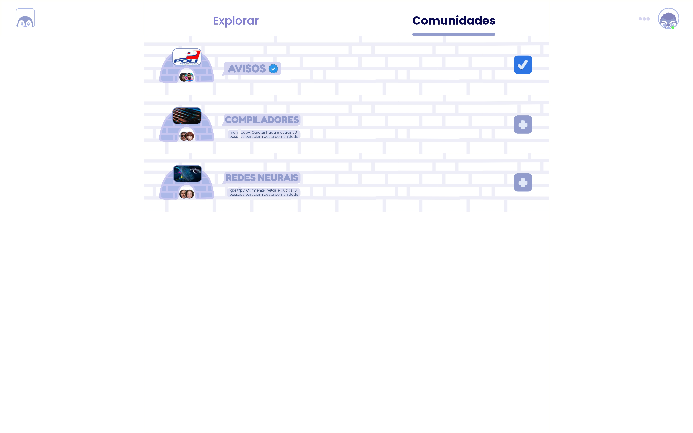
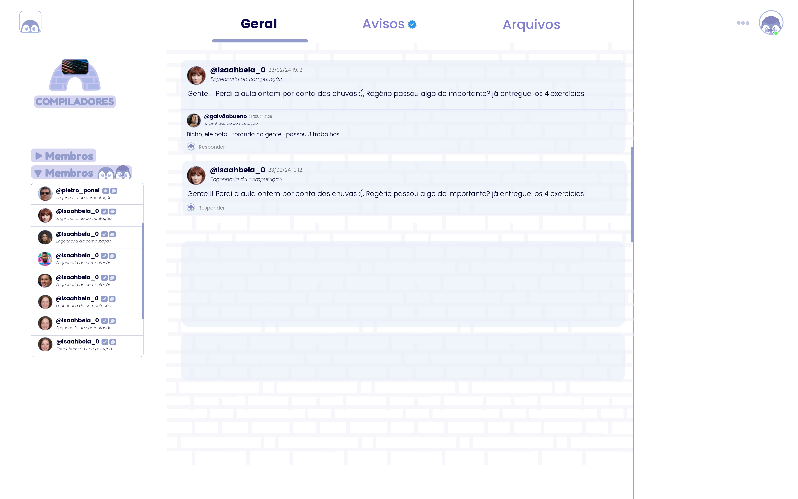
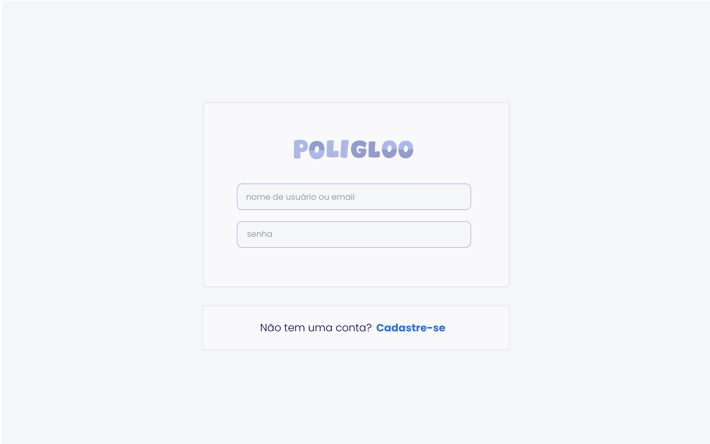

# PoliGloo
A social media built focusing on communities for a specific university, where people can share information easily.
If you want to know more and know a bit of portuguese, there is a doc explaning everything: https://docs.google.com/document/d/1aTyX6FnJRKoftxxl-CYChKIDJFpWFkioMtI_tQ85-ww/edit?usp=sharing

